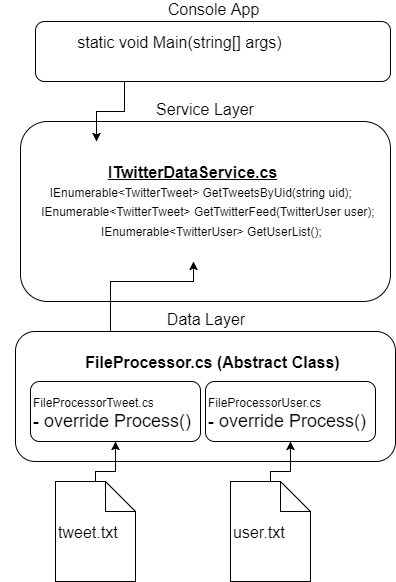
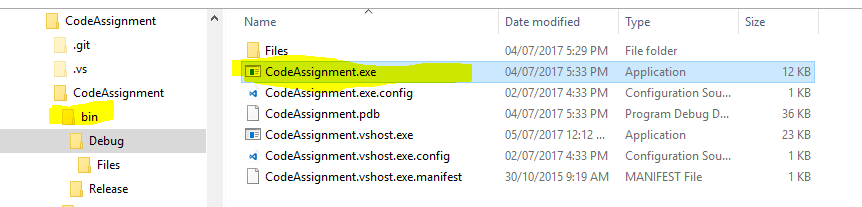
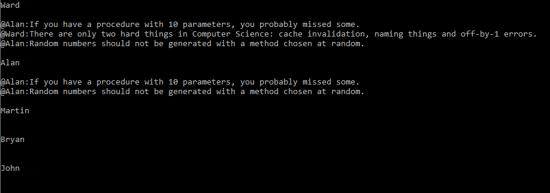
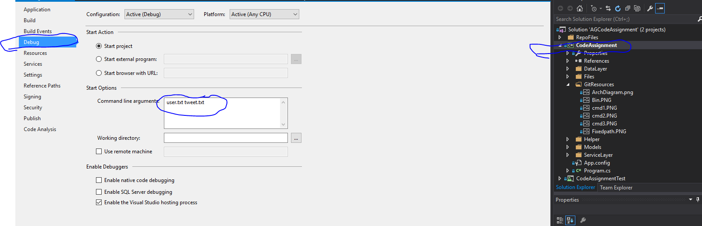

<h1>About</h1>
This application was built as a simple console app in C# due to the simplicity of the requirement. This program can be launched using the command line and passing the name of the two input files in as arguments. The directory of these files has been fixed (for no reason other than simplicity) and only the name of the files can be changed. I.e The files must always be stored in the "Files" directory in the root folder of the .exe

 
<h1>Application Architecture</h1>

<h2>Some points on the architecture</h2>
<ol>
  <li>Abstract class used to handle file inputs that could be used to create a generic repository, with each new file the "Process" method must be overrideen in the new implementation</li>
  <li>Service layer created to abstract data logic from application logic, ie files could be replaced with api feed. This implementation of this service would normally injected as a dependency using IoC</li>
  <li>Basic exception handling done</li>
  <li>No Logging as this is a small console application</li>
  <li>Unit Tests Not written</li>
</ol>

<h1>How To Launch</h1>

<h2>Cloning The Repo</h2>
By cloning this repo, building the project and then running the exe found in the bin folder from the command line and passing the two arguments
E.g.  
1 - Find the exe in the bin folder  

2 - Use command line to enter the projects directory using "cd"  

3 - Run the programe exe from command passing in the two arguments "user file" and "tweet file"  

Result  

<h2>Debug in Visual Studio</h2>

<ol>
  <li>Download the Repo</li>
  <li>Open the project</li>
  <li>Make sure the default arguments have been set</li>
  <li>Debug</li>
</ol>

